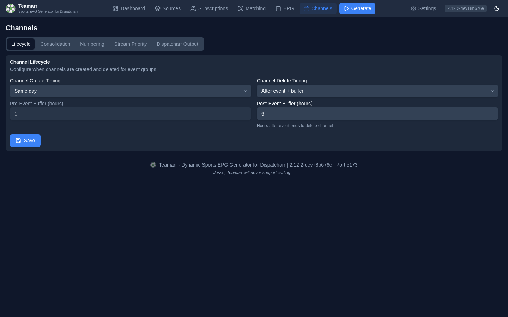

# Lifecycle

Controls when event channels are created in and deleted from Dispatcharr.

## Create Timing

| Mode | Description |
|------|-------------|
| **Same day** | Create channels on the day of the event |
| **Before event + buffer** | Create channels a configurable number of hours before the event starts |

The **Pre-Event Buffer (hours)** field is greyed out until **Before event + buffer** is selected; it sets how many hours before the event to create the channel (0–336 hours, default 1).

For session-based events (race weekends, UFC card segments), each session's channel is timed against that session's own start — the Sunday race channel appears on race day (or race start minus buffer), not when Friday practice enters the window.

### Per-league create timing

One window rarely suits every sport: wide enough to show the weekend's NFL games on a Thursday also fills the guide with three days of baseball. A league can carry its own create timing under [Per-League Channel Config](output.md#per-league-channel-config) (Channels → Dispatcharr Output): **Default** follows the setting above, **Same day** and **Before event + buffer** replace it for that league only. Keeping the global setting on **Same day** and giving NFL **Before event + buffer** at 72 hours shows each NFL game three days out while everything else appears on game day.

What it does not do:

- **It never creates a channel on its own.** The window says how early a channel *may* exist; one is created once a stream for the game is listed by your provider and matched.
- **It cannot reach past the matching window.** Streams are matched **Event match days ahead** days out (default 3, on the Matching page). A buffer longer than that needs the matching window raised too; the form warns when it is.
- **It is per league, not per sport.** Soccer means setting it on each competition you follow.
- **It is a number of hours before each event**, not a weekly reset — generation still runs on its one schedule.
- **Deletion is unaffected.** Delete timing stays global.

Managed team channels follow the same per-league window when deciding whether a game is close enough to attach.

An event that has finished keeps its channel and its guide programmes until the channel's delete time, and a stream first matched in that window still gets a channel. An event already past its delete threshold is skipped entirely.

## Postponed Events

**Create channels for postponed events** (on by default) controls whether a postponed event gets an event channel. With it off, a matched postponed event is excluded at channel creation — it shows in Run History as "Event is postponed" — and a channel that already exists for an event that becomes postponed is deleted on the next run. Managed team channels always skip postponed games.

## Delete Timing

| Mode | Description |
|------|-------------|
| **Same day** | Delete channels at the end of the event's day (23:59 on the day the event is estimated to end) |
| **After event + buffer** | Delete channels a configurable number of hours after the event ends |

The **Post-Event Buffer (hours)** (0–336, default 1) sets how many hours after the event ends to keep the channel (e.g., 2 hours for postgame coverage). "Ends" is an **estimate**: start time plus a per-sport default duration (configurable under [EPG → Output](../epg/output#default-durations)). For session-based events like race weekends, the creation-time window uses the last session's start plus its duration; the per-run recalculation uses each channel's own start time plus the sport duration.

{: .note }
Events that cross midnight always use the post-event buffer for deletion, even in "Same day" mode, so a channel isn't pulled out from under a game in progress.

Deletion times are **recalculated from current settings on every run** — changing the buffer retroactively re-times channels that already exist.

## How channels get deleted

The timing above is only one of several deletion paths. Each generation run also performs these cleanups:

- **Vanished or rotated streams** — when a stream disappears from the M3U, its content changes, or it rotates to a different event, it's detached from the channel. The channel itself is deleted only when *no* valid streams remain. If the same run has matched a replacement stream for that event (a provider re-issuing the game under a new stream id), the channel is kept and the new stream takes over, so the channel does not change identity in Dispatcharr. This runs regardless of delete timing, and also on a run where the source matched nothing — with one limit: on such a run only a stream that is still in the M3U under different content is detached, never one that is merely absent, so a mis-bound group pattern or a half-refreshed M3U cannot cascade into deletions.
- **Disabled sources** — disabling a source detaches its streams stream-by-stream; a channel is deleted only if nothing else feeds it (consolidated channels survive).
- **Unsubscribed leagues** — unchecking a league in [Subscriptions](../subscriptions) deletes that league's channels on the next run.
- **Orphan cleanup** — Teamarr-tagged channels in Dispatcharr that aren't tracked locally are removed.

Deleted channels appear in the **Recently Deleted** section of the [Dashboard](../dashboard#managed-channels).

## Sync reliability

Channel create/update/stream writes to Dispatcharr are confirmed before Teamarr's local record updates — if a Dispatcharr API call fails, the local state stays unchanged and the drift is detected and corrected on the next generation run. Profile assignments self-heal the same way, by comparing against Dispatcharr's actual state. Channels whose actual state has diverged show a **Drifted** badge in the Dashboard's Managed Channels table until the next run corrects them.
