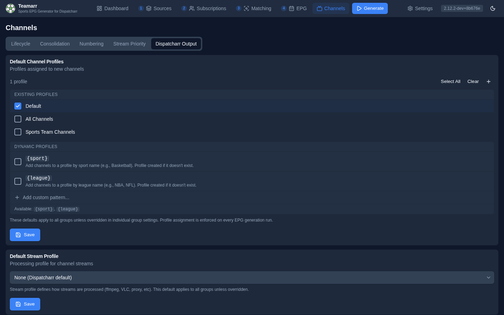

# Dispatcharr Output

How Teamarr writes its channels into Dispatcharr — which profiles they appear in, which stream profile processes them, and which channel group they land in. Set global defaults here, then override them per league where needed.

{: .note }
Dispatcharr **connection** (URL, credentials), the **EPG source**, and **logo cleanup** live in [Settings → Dispatcharr](../settings/dispatcharr) — those are connection and housekeeping concerns, not channel routing.

## Default Channel Profiles

Which Dispatcharr profiles new Teamarr channels are assigned to. These defaults apply to all sources unless overridden per league. Profile assignment is re-enforced on every EPG generation run.

The selector lists your existing profiles as checkboxes, plus two **dynamic profile** entries — `{sport}` and `{league}` — and an **Add custom pattern…** input for combined patterns (a custom pattern must contain `{sport}` or `{league}`). Dynamic profiles are created in Dispatcharr on demand: check `{sport}` and every channel is also added to a profile named for its sport.

## Default Stream Profile

The Dispatcharr stream profile applied to channel streams. The stream profile defines how streams are processed (ffmpeg, VLC, proxy, etc.). This default applies everywhere — there is **no per-league stream-profile override**.

## Default Channel Group

The Dispatcharr channel group new channels are assigned to, plus how that group is chosen.

### Channel Group

Pick a static group from the dropdown. By default the list hides M3U-sourced groups; toggle **Show M3U-sourced channel groups** to assign a group that originated from an M3U account.

### Group Mode

| Mode | Description |
|------|-------------|
| **Static** | All channels go to the selected group above |
| **Dynamic by Sport** | Auto-creates and assigns groups named by sport |
| **Dynamic by League** | Auto-creates and assigns groups named by league |
| **Custom pattern** | Define a pattern using `{sport}`, `{league}`, `{conference}`, `{conference_abbrev}`, and `{division}` placeholders |

When **Custom pattern** is selected, a pattern field appears. For example, `{sport} | {league}` creates groups like "Hockey | NHL". Teamarr creates these dynamic groups in Dispatcharr automatically.

In group patterns, `{sport}` resolves to the sport's display name ("Hockey"), and `{league}` to the league's **short alias** — "EPL", not "English Premier League". `{conference}` resolves to the home team's conference name for NCAA football/basketball events ("Southeastern Conference"), `{conference_abbrev}` to its compact form ("SEC", "ACC", "Big Ten"), and `{division}` to that conference's division — **FBS** or **FCS** for college football, **Division I** for college basketball. Events without conference data fall back to the static group.

{: .note }
`{division}` is the light-touch way to tame a college football Saturday: `{league} | {division}` splits ~80 games into "NCAAF | FBS" and "NCAAF | FCS" without the 25 groups `{conference}` produces. When you do want per-conference groups but not the long names, `{conference_abbrev}` gives you "NCAAF | SEC" instead of "NCAAF | Southeastern Conference". All three wildcards bucket on the **home** team, so an FBS-vs-FCS game lands in FBS — which is where you want it, since the FCS side is the visitor in those matchups. `{division}` needs a conference-tree refresh (Settings → Cache → Refresh) before it resolves; until then those events fall back to the static group.

A few failure modes are handled gracefully: a pattern whose wildcard can't resolve for an event falls back to the static group; and if a configured static group has been deleted in Dispatcharr, the channels are created **ungrouped** with a log warning telling you to re-select a group.

## Per-League Channel Config

Override channel profiles, channel groups, group modes, and the [matchup order](../settings/general.md#matchup-order) on a per-league basis. The **Subscribed only** toggle is on by default, so the table opens with just your subscribed leagues (turn it off to see all; the search field filters within whatever's visible). Click a league row to expand its configuration.

### Available Overrides

| Setting | Options | Description |
|---------|---------|-------------|
| **Channel Profiles** | Default or specific profiles | Which Dispatcharr profiles this league's channels appear in |
| **Channel Group** | Default or specific group | Which Dispatcharr channel group to assign channels to |
| **Channel Group Mode** | Default, Static, Dynamic by Sport, Dynamic by League, Custom | How the channel group is determined |
| **Divisions** | All (default) or a subset | Which divisions of an NCAA league to ingest at all — college football and both college basketballs only |

When Channel Group Mode is set to **Custom**, a pattern field appears where you can enter a template like `{sport} - {league}` that dynamically creates groups.

{: .note }
Per-league overrides take precedence over the global defaults above. Use the **X** button to clear an override and revert to the default.

**Divisions** narrows what Teamarr fetches for the NCAA leagues ESPN splits across division scoreboards: college football (**Division I (FBS & FCS)** / **Division II & III**), men's and women's college basketball, and women's college volleyball (**NCAA Division I** / **Non-NCAA Division I**). Every other NCAA league fetches a single Division I slate, so it has nothing to select. Deselecting a division means those games are never requested — no matching cost, no channels, and no lower-division events falling back into your default group because `{division}` can't name them. ESPN files a game under a division when *either* side belongs to it, so cross-division fixtures (an FCS team hosting a Division II opponent) survive with Division I alone; only games played entirely inside a dropped division disappear. Leave every division checked — the default — and nothing changes.

{: .note }
If you use `{division}` in a group pattern and see lower-division games landing in your default channel group, this is the setting: the conference tree only names FBS and FCS, so a Division II or III home team has no division to resolve. Deselect **Division II & III** and those games stop being ingested altogether.

**Matchup Order** decides which team `{matchup}` and `{team1}`/`{team2}` name first for that league: **Default** inherits the global setting under Settings → General → Localization; **Auto** follows the sport's convention; **Away first** / **Home first** force it. Useful when one competition breaks its sport's habit (a soccer league you want listed visitor-first, or vice versa).
