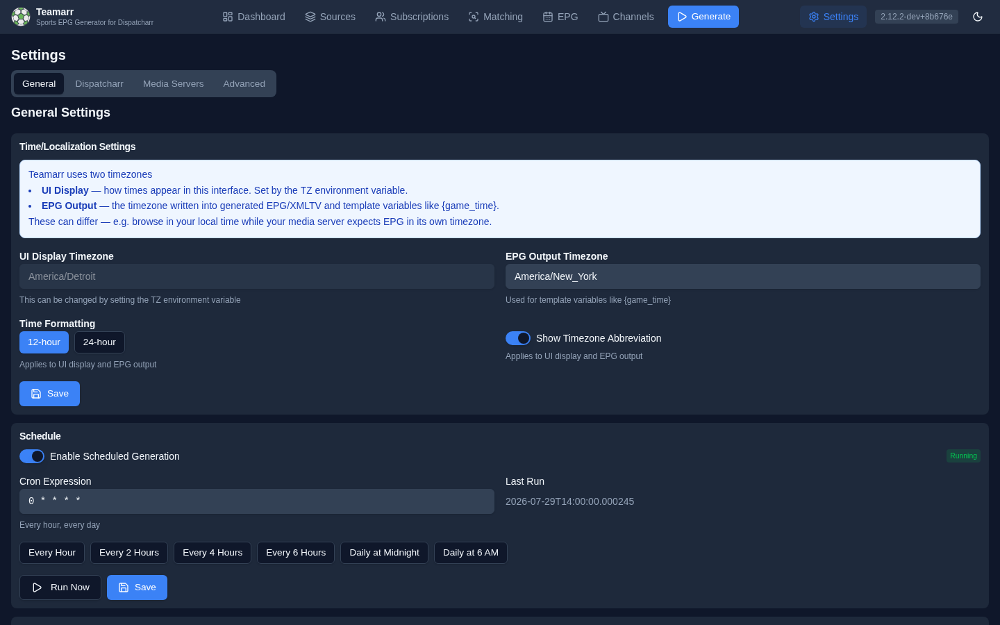

# General Settings

System-level configuration: time, scheduled generation, the TheSportsDB API key, and update notifications.



## Time / Localization

Teamarr uses two timezones — they can differ on purpose (browse in your local time while your media server expects EPG in its own timezone):

| Timezone | What it controls | Where it's set |
|----------|------------------|----------------|
| **UI Display** | How times appear in this web interface | The `TZ` environment variable (read-only in the UI). When `TZ` is unset or invalid, the UI falls back to the EPG Output timezone |
| **EPG Output** | The timezone written into generated EPG/XMLTV and template variables like `{game_time}` | Editable here |

```yaml
# docker-compose.yml example
environment:
  - TZ=America/New_York
```

### Time Formatting

- **Time format** — 12-hour (`3:45 PM`) or 24-hour (`15:45`). Applies to both the UI and EPG output.
- **Show timezone abbreviation** — toggle whether abbreviations (EST, PST, …) appear alongside times.

## Schedule

Enable automatic EPG generation on a cron schedule. A status badge shows whether the scheduler is **Running** or **Stopped**, along with the last run time.

### Cron Expression

Standard cron format. Presets are one click away:

| Preset | Expression |
|--------|------------|
| Every Hour | `0 * * * *` |
| Every 2 Hours | `0 */2 * * *` |
| Every 4 Hours | `0 */4 * * *` |
| Every 6 Hours | `0 */6 * * *` |
| Daily at Midnight | `0 0 * * *` |
| Daily at 6 AM | `0 6 * * *` |

Below the field, a plain-English description of the expression confirms what you typed ("Every hour, every day" — or "Invalid cron expression").

### Run Now

Manually trigger a full generation run without waiting for the schedule.

## TheSportsDB API Key

**Required for every TheSportsDB-sourced league.** TheSportsDB's free tier was deprecated in v2.15 — without a key, TSDB leagues produce no events and no team channels, the league picker crowns them, and a startup log lists any subscribed ones. The same key gates [Custom Leagues](../subscriptions#custom-leagues). A premium key is ~$9/month (100 req/min, full event coverage + team schedules) — get one at [thesportsdb.com/pricing](https://www.thesportsdb.com/pricing).

A saved key displays masked (`********`); type over it to replace it. The **Configured** badge in the card header only means a key is stored — it isn't validated. To actually verify a key, **retype it and click Validate**, which tests it against TSDB live (clicking Validate on the masked placeholder will report invalid).

See [TSDB Provider](../../reference/providers/tsdb) for technical details.

## Update Notifications

Teamarr can check for new versions and notify you when updates are available.

- **Current Version** — your running version (dev builds show commit hashes) with its release date and a "Last checked" timestamp. When an update is available, an **Update Available** badge appears with the newer version and a **View Update** button linking to the release.
- **Enable automatic update checks** — toggle update checking on/off. With checks disabled, the version card shows no update info.
- **Notify about stable releases** / **Notify about dev builds** — which release channels to notify about.
- **Check Now** — manually trigger an immediate check (bypasses the cache; automatic checks are cached for one hour).

For forks, the check target (GitHub owner/repo/branch) is configurable via the API (`PUT /settings/update-check`) — there's no UI for it.
