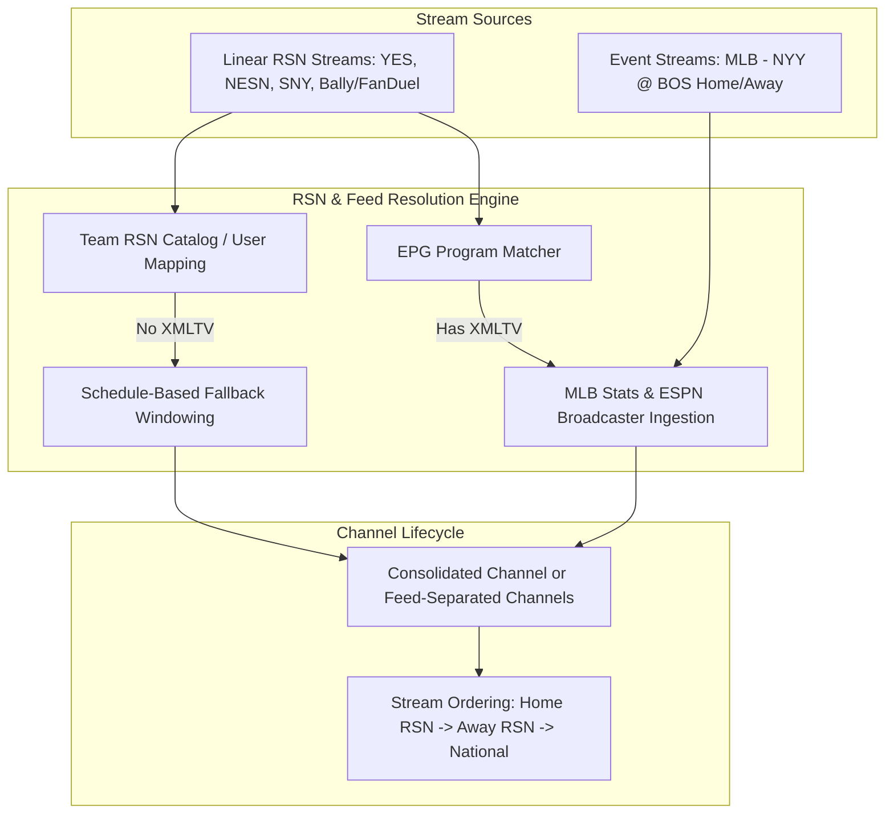

# RSN Integration: Feasibility Report & Phased Roadmap

## 1. Executive Summary

This document evaluates the feasibility and provides an architectural blueprint and phased implementation plan for integrating **Regional Sports Networks (RSNs)** (e.g., YES Network, NESN, Marquee Sports Network, SNY, Spectrum SportsNet LA, FanDuel/Bally Sports) into Teamarr's Home and Away feeds.

### Feasibility: **High**
* **Estimated Effort:** 5–7 developer days total across 4 testable, shippable phases.
* **Fit with Existing Architecture:** Teamarr already has the core foundations:
  - Feed side and team resolution (`feed_side.py`, `matching.py`)
  - EPG program matching and time-windowed stream attachment (`epg_matcher.py`, `creator.py`)
  - Broadcast market matching (`_detect_feed_from_broadcast_markets`)
  - Stream priority rules (`home_feed`, `away_feed`, `team_feed`, `epg_match`)

### Core Guiding Principle: **Zero-Guessing on Ambiguity**
- **1:1 Unambiguous RSNs (e.g., YES → Yankees, NESN → Red Sox):** Automatically resolve to the team's Home or Away feed.
- **Ambiguous Multi-Team RSNs (e.g., MASN covering Orioles & Nationals):** When EPG data does not specify the matchup, **make no assumptions** and skip auto-attachment.
- **User Custom Mappings:** Allow users to define explicit stream regex → team mappings (e.g., `MASN` → Orioles, `MASN2` → Nationals) which act as 100% authoritative overrides.

---

## 2. Current Architecture vs. The Gap

| Mechanism | Current Behavior | The Gap with RSNs |
| :--- | :--- | :--- |
| **EPG Program Matching** | Reads Dispatcharr/Xtream XMLTV guide data (`"MLB Baseball \| Red Sox at Yankees"`). | Many IPTV providers supply **poor, generic, or missing EPG** for RSNs (`"Live MLB"`, `"Baseball Tonight"`, or blank), preventing EPG matching from linking to the event. |
| **Broadcast Market Matching** | Checks ESPN scoreboard `broadcasts[].market` (e.g. `YES` → `home`). | ESPN scoreboard data is inconsistent, does not cover all regional feeds/alt feeds, and naming formats vary (`"YES Network"`, `"YES HD"`, `"NESN+"`). |
| **RSN-to-Team Knowledge** | None. Teamarr has no built-in knowledge that YES = Yankees or NESN = Red Sox. | Linear RSN streams cannot be resolved to a feed side unless both the EPG program match and broadcast market match succeed. |
| **Schedule-Based Attachment** | Only works for `team_streams_enabled` (single-team fan-out on event M3U groups). | A 24/7 linear channel without XMLTV guide data cannot be scheduled onto upcoming team games automatically. |

---

## 3. High-Level Architecture Flow



---

## 4. Implementation Roadmap

| Phase | Deliverable | Key Focus | Verification Gate |
| :--- | :--- | :--- | :--- |
| **Phase 1** | MLB 1:1 RSN catalog + broadcaster data parsing in `MLBStatsProvider` & `ESPNProvider` + feed resolution in `matching.py`. | **Zero-guessing:** 1:1 RSNs auto-resolve; ambiguous multi-team RSNs with no EPG return `None`. | Pytest unit tests for provider parsing and feed resolution. |
| **Phase 2** | DB table, FastAPI CRUD routes, and React Settings UI for custom user broadcaster mappings (e.g. `MASN` → Orioles). | **User Authority:** User mappings override defaults and disambiguate multi-team networks. | API route tests + UI component tests. |
| **Phase 3** | Schedule-based time-windowing in `creator.py` for unguided linear RSN streams. | **Safe Fallback:** If an RSN has no XMLTV data, attach during game window based on team schedule. | Lifecycle engine tests verifying attach/detach timing. |
| **Phase 4** | Stream ordering integration (`team_feed`, `home_feed`, `away_feed`), feed-separated channel naming, and docs. | **Seamless Output:** RSNs sort cleanly into Home/Away split channels or consolidated channels. | End-to-end stream ordering & lifecycle tests. |

---

## 5. Ready-to-Use Phase Prompts

### Phase 1 Prompt: RSN Catalog & Broadcaster Ingestion

```markdown
### Task: Implement MLB RSN Catalog and Broadcaster Ingestion (Phase 1)

We want to introduce Regional Sports Network (RSN) feed resolution for MLB in Teamarr.

#### Requirements:
1. **Pre-seeded 1:1 MLB RSN Catalog:**
   - Create a catalog module (e.g., `teamarr/core/rsn_catalog.py`) mapping unambiguous, single-team MLB RSNs to their team abbreviations and common regex/alias patterns:
     - `YES` / `YES Network` -> `NYY` (Yankees)
     - `NESN` / `NESN+` -> `BOS` (Red Sox)
     - `Marquee` / `Marquee Sports Network` -> `CHC` (Cubs)
     - `SNY` / `SportsNet New York` -> `NYM` (Mets)
     - `Spectrum SportsNet LA` / `SportsNet LA` -> `LAD` (Dodgers)
     - Other unambiguous 1:1 MLB regional networks.
   - Ambiguous / multi-team networks (e.g. `MASN` covering both Orioles & Nationals) must be flagged as ambiguous or excluded from automatic 1:1 resolution.

2. **Provider Broadcaster Ingestion:**
   - In `teamarr/providers/mlbstats/provider.py`, update `get_events` / `_parse_game` to ingest the `broadcasts` array from MLB StatsAPI schedule payloads, extracting TV network names and their `homeAway` designation into `Event.broadcast_markets`.
   - In `teamarr/providers/espn/provider.py`, ensure `_parse_broadcast_markets` continues to capture home/away designations for regional broadcasts.

3. **Feed Side & Team Resolution:**
   - In `teamarr/consumers/event_group_processor/matching.py` (`_resolve_feed_teams` / `_detect_feed_from_broadcast_markets`), incorporate the RSN catalog:
     - If a stream's name/tvg_id/tvg_name matches a 1:1 RSN, check if the event features that RSN's team.
     - If the team is `home`, set `feed_side = "home"` and `stream_feed_team = event.home_team`.
     - If the team is `away`, set `feed_side = "away"` and `stream_feed_team = event.away_team`.
     - **Strict Rule:** If an RSN is ambiguous (multi-team) and there is no explicit EPG matchup data, return `None` (no guessing).

4. **Testing:**
   - Write comprehensive unit tests in `tests/matching/test_rsn_feed_resolution.py` testing:
     - Unambiguous RSN stream name (e.g., "US: YES Network HD") matching a Yankees vs Red Sox game -> resolved as Home feed.
     - Away RSN stream name (e.g., "NESN") matching the same game -> resolved as Away feed.
     - Ambiguous RSN stream without EPG -> returns None / UNKNOWN.
```

---

### Phase 2 Prompt: User-Defined Broadcaster Mappings (DB, API & UI)

```markdown
### Task: Implement User-Defined Broadcaster & RSN Mappings (Phase 2)

Enable users to manually map custom stream names, regexes, or channels to specific teams to disambiguate multi-team RSNs (like MASN) or handle custom IPTV naming schemes.

#### Requirements:
1. **Database Schema & Migrations:**
   - Add a versioned migration in `teamarr/database/migrations/versioned.py` creating the `team_broadcaster_mappings` table:
     - `id` (INTEGER PRIMARY KEY AUTOINCREMENT)
     - `name` (TEXT) — user label, e.g. "MASN Orioles"
     - `pattern` (TEXT) — match string or regex pattern (e.g. `(?i)\bMASN\b`)
     - `pattern_type` (TEXT) — `regex`, `exact`, `tvg_id`, or `channel_id`
     - `team_id` (TEXT) — provider team ID or team abbreviation
     - `league` (TEXT) — e.g. `mlb`
     - `is_active` (BOOLEAN DEFAULT 1)
     - `created_at`, `updated_at` (TIMESTAMP)

2. **Database Access Layer & FastAPI Routes:**
   - Implement CRUD operations in `teamarr/database/` for broadcaster mappings.
   - Add API routes under `/api/settings/broadcasters` (or under `/api/settings/feed-separation/broadcasters`):
     - `GET /api/settings/broadcasters/` — list all custom mappings + default catalog entries.
     - `POST /api/settings/broadcasters/` — create custom mapping.
     - `PUT /api/settings/broadcasters/{id}` — update mapping.
     - `DELETE /api/settings/broadcasters/{id}` — delete mapping.

3. **Frontend UI (Settings Tab):**
   - Add a "Broadcasters / RSNs" sub-section under **Settings -> Feed Separation** (or a dedicated tab).
   - Display:
     - Built-in default RSN mappings (read-only reference with override option).
     - User custom mappings table with columns: Name, Pattern, Match Type, Target Team, Status, Actions.
     - Modal to add/edit a mapping with a team picker filtered by league.

4. **Testing:**
   - Write API tests in `tests/api/test_broadcaster_mappings.py` verifying full CRUD lifecycle.
```

---

### Phase 3 Prompt: Schedule Windowing for Unguided Linear RSNs

```markdown
### Task: Schedule-Based Time-Windowing for Mapped RSN Streams (Phase 3)

Allow linear 24/7 RSN streams that have no XMLTV program guide (or only generic "MLB Baseball" guide data) to automatically attach to their mapped team's event channels during game windows.

#### Requirements:
1. **Schedule-Based Candidate Matching:**
   - In `teamarr/consumers/matching/matcher.py` (or as part of linear channel scanning):
     - When processing a linear stream that matches an unambiguous 1:1 RSN (or user-mapped broadcaster) but has no specific EPG matchup:
     - If the mapped team has a scheduled event on `target_date`, generate a synthetic `MatchResult` attaching the stream to that event.
     - If multiple games exist for that team (doubleheader), bind each according to its time slot.
     - If an RSN is ambiguous and unmapped by the user, skip candidate generation.

2. **Time-Window Calculation:**
   - In `teamarr/consumers/lifecycle/creator.py` (`compute_stream_window`):
     - For schedule-matched RSN streams, calculate the active window from the event start time:
       - `attach_at = event.start_time - epg_pre_buffer (default 60m)`
       - `detach_at = event.start_time + sport_duration + epg_post_buffer (default 60m)`
     - Tag `match_method = "rsn_schedule"`.

3. **Lifecycle & Stream Attachment:**
   - Ensure the channel creation and dynamic resolver attach the stream to the event channel (and feed-separated home/away channel) during the computed window, detaching it when outside the window.

4. **Testing:**
   - Write integration tests in `tests/lifecycle/test_rsn_schedule_windowing.py` verifying:
     - An unguided "YES Network" stream attaches to a 7:05 PM Yankees game channel at 6:05 PM and detaches post-game.
     - Ambiguous RSN streams with no user mapping do not attach.
```

---

### Phase 4 Prompt: Stream Ordering, Feed Separation & Hardening

```markdown
### Task: Stream Ordering Rules & End-to-End Hardening (Phase 4)

Ensure RSN streams are prioritized properly within consolidated event channels and feed-separated channels.

#### Requirements:
1. **Stream Ordering Rules:**
   - In `teamarr/services/stream_ordering.py`:
     - Ensure `team_feed`, `home_feed`, and `away_feed` rules seamlessly match RSN streams based on the persisted `stream_feed_side` and `feed_team_id`.
     - Optionally add an `rsn_stream` rule type / score modifier to allow users to prioritize regional broadcasts over national broadcasts (or vice versa).

2. **Feed Separation Integration:**
   - Verify that when `feed_separation_enabled` is active:
     - RSN streams resolved to `home` attach exclusively to the `(Home Feed)` channel.
     - RSN streams resolved to `away` attach exclusively to the `(Away Feed)` channel.
     - Channels without an active RSN feed gracefully fall back to generic / national feeds.

3. **Documentation:**
   - Update `docs/guide/matching/` and `docs/guide/channels/stream-priority.md` explaining RSN matching, 1:1 auto-resolution, and user custom mapping options.

4. **Testing:**
   - Write end-to-end tests in `tests/lifecycle/test_rsn_stream_ordering_e2e.py` covering full lifecycle: ingestion -> matching -> stream ordering -> channel generation.
```
